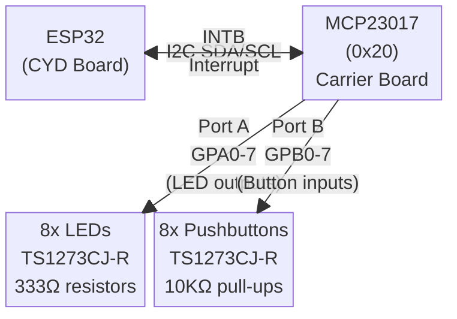
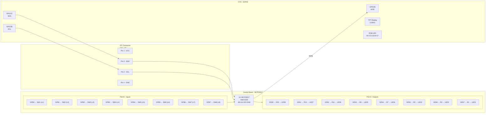

# ETC 9000 - Hardware Documentation

## System Block Diagram

## Connection Diagram

## I2C Address
MCP23017 address pins A0, A1, A2 all tied to GND → **Address = 0x20**

## ESP32 Pin Assignment

| ESP32 GPIO | Function        | Notes                                      |
|------------|-----------------|-------------------------------------------|
| 14         | SPI SCK         | TFT display                               |
| 12         | SPI MISO        | TFT display                               |
| 13         | SPI MOSI        | TFT display                               |
| 15         | TFT_CS          | TFT chip select                           |
| 2          | TFT_DC          | TFT data/command                          |
| 21         | TFT_BL          | TFT backlight ⚠️ conflicts with default I2C SDA |
| 4          | LED_RED         | CYD RGB LED (active LOW)                  |
| 16         | LED_GREEN       | CYD RGB LED (active LOW)                  |
| 17         | LED_BLUE        | CYD RGB LED (active LOW)                  |
| 26         | I2C SCL         | To MCP23017 SCL (use Wire.begin(27,26))   |
| 27         | I2C SDA         | To MCP23017 SDA (use Wire.begin(27,26))   |
| 35         | INTB (input)    | MCP23017 interrupt B — input-only pin     |

> ⚠️ **GPIO21 conflict:** GPIO21 is used for TFT backlight. Do NOT use as default I2C SDA.
> Use `Wire.begin(27, 26)` in code for MCP23017.

## MCP23017 Port Map

| MCP23017 Port | Direction | Function         | Logic        |
|---------------|-----------|------------------|--------------|
| GPA0 (pin 21) | Output    | LED 8            | Active HIGH  |
| GPA1 (pin 22) | Output    | LED 7            | Active HIGH  |
| GPA2 (pin 23) | Output    | LED 6            | Active HIGH  |
| GPA3 (pin 24) | Output    | LED 5            | Active HIGH  |
| GPA4 (pin 25) | Output    | LED 4            | Active HIGH  |
| GPA5 (pin 26) | Output    | LED 3            | Active HIGH  |
| GPA6 (pin 27) | Output    | LED 2            | Active HIGH  |
| GPA7 (pin 28) | Output    | LED 1 (Green)    | Active HIGH  |
| GPB0 (pin 1)  | Input     | Pushbutton SW1   | Active LOW   |
| GPB1 (pin 2)  | Input     | Pushbutton SW2   | Active LOW   |
| GPB2 (pin 3)  | Input     | Pushbutton SW3   | Active LOW   |
| GPB3 (pin 4)  | Input     | Pushbutton SW4   | Active LOW   |
| GPB4 (pin 5)  | Input     | Pushbutton SW5   | Active LOW   |
| GPB5 (pin 6)  | Input     | Pushbutton SW6   | Active LOW   |
| GPB6 (pin 7)  | Input     | Pushbutton SW7   | Active LOW   |
| GPB7 (pin 8)  | Input     | Pushbutton SW8   | Active LOW   |

## Connectors

| Connector | Type              | Pins | Function                    |
|-----------|-------------------|------|-----------------------------|
| CN1       | JST 4-pin 1.25mm  | VCC, SCL, SDA, GND | I2C to CYD     |
| P1        | JST 4-pin 1.25mm  | VCC, SCL, SDA, GND | I2C (same as CN1) |
| P3        | JST 4-pin 1.25mm  | GND, GPIO35, NC, INTB | Interrupt/status |
| P4        | IDC 10-pin 2.54mm | 5V (pins 1-4), GND (pins 5-8) | Power |

## Key Notes for Code
- `Wire.begin(27, 26)` — use non-conflicting I2C pins
- MCP23017 IODIRA = 0x00 (all Port A = outputs for LEDs)
- MCP23017 IODIRB = 0xFF (all Port B = inputs for buttons)
- MCP23017 GPPUB = 0xFF (enable pull-ups on Port B)
- Read buttons: `Wire.read()` from GPIOB register — LOW = pressed
- Write LEDs: write to GPIOA register — HIGH = LED on
- INTB on GPIO35 → attach interrupt for button events
